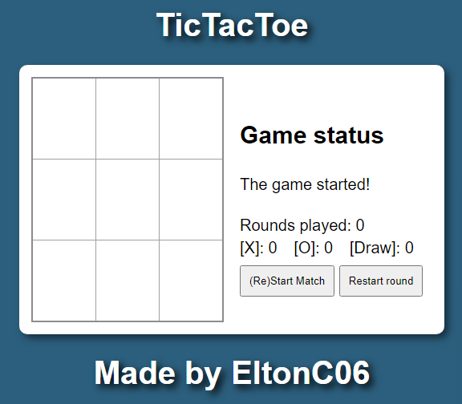
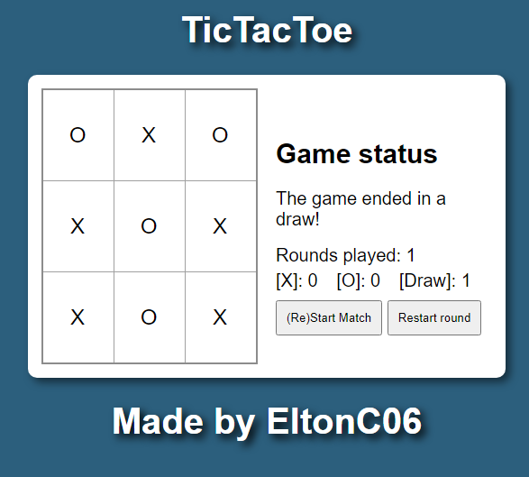
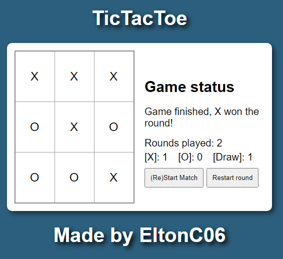

# Tic-Tac-Toe Front End

## About the Project

This is the front-end of the Tic-Tac-Toe game, developed to work seamlessly with the back-end Spring Boot application. The goal is to provide a user-friendly interface for players to enjoy the classic game of Tic-Tac-Toe.

## Images:








## Technologies Used

- **Front-end**
  - HTML
  - CSS
  - JavaScript

- **Back-end**
  - Java
  - Spring Boot
  - H2 Database

## How to Run the Project

### Prerequisites

- A running instance of the back-end application.
    - Preference to use the 8080 port to run the back-end.
    - Caution: Tested only using Spring Tool Suite.
- A web server for front-end (you can use Live Server extension in VS Code).

### Instructions

1. **Set Up the Back-End**
   - Follow the instructions in the [Tic-Tac-Toe Spring README](https://github.com/EltonC06/TicTacToeSpring/blob/main/README.md) to run the back-end application.

2. **Clone the Front-End Repository**
   ```bash
   git clone git@github.com:EltonC06/TicTacToe-frontend.git
   ```

3. **Open the Project**
   - Open the project folder in your preferred code editor.

4. **Run the Front-End**
   - Use the Live Server extension (or any other web server) to serve the front-end files.

### Note
- If you want to test the application, please follow the instructions for the back-end project. Start by running the back-end server.

- After the back-end server is running, proceed to run this front-end application so they can be integrated properly.

- **Important:** It is recommended to use the port 8080 to host the back-end application.

## Author

Elton da Costa Oliveira

[LinkedIn](https://www.linkedin.com/in/elton-da-costa/)